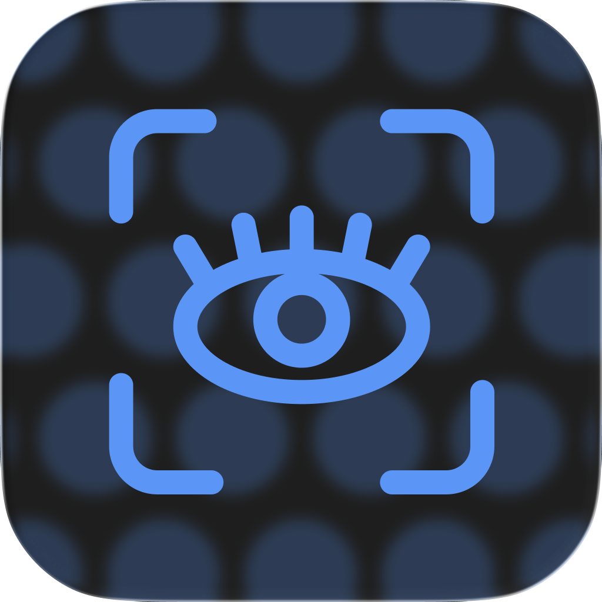
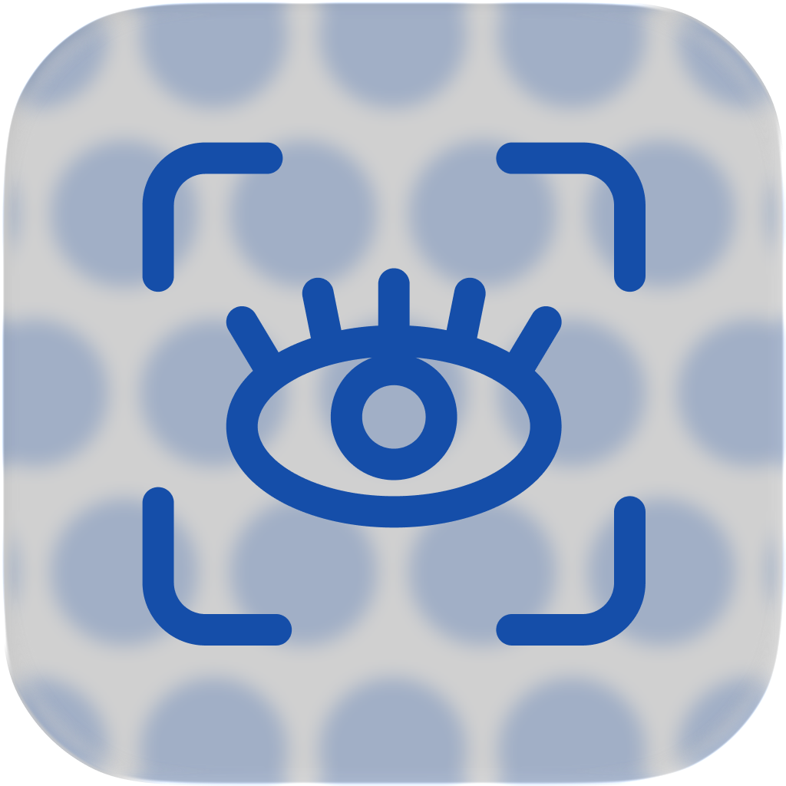

# MD-Prev: Markdown Previewer

<p align="center">
  
  &nbsp;&nbsp;&nbsp;&nbsp;
  
</p>

**MD-Prev** is a lightweight, Markdown previewer built for macOS. By running purely in the background and monitoring your Finder selection, MD-Prev provides an auto-updating rendering of your Markdown files as you navigate your file system—without the need to open or close files manually.

## ✨ Features

- **Finder Polling & Live Preview:** Just click a `.md` file in the macOS Finder, and the previewer updates instantly via AppleScript.
- **Premium "Liquid Glass" UI:**
  - Dynamic optical refraction powered by SVG displacement mapping (chrome-based only).
  - Frosted glass vignette borders that fade seamlessly into the background.
  - Auto-adapts to your macOS system theme (Light/Dark mode) including dynamic Dock icon swapping.
- **Interactive Morphing Search Bar:** 
  - A minimalist floating button that morphs into a full search pill.
  - Live text highlighting with keyboard navigation (`Enter`/`Shift+Enter` or Up/Down arrows, `Esc` to close).
- **"Always on Top" Pin:** Toggle a floating window state to keep your reference material visible while typing in another app.
- **Rich Markdown Support:**
  - Full GitHub Flavored Markdown (GFM).
  - Code syntax highlighting (powered by `pygments`).
  - Integrated **Mermaid.js** support for flowcharts, diagrams, and sequence charts.
  - Tables, Checklists, and TOC support.
- **Modular & Hackable:** Clean separation of concerns (HTML templates, CSS styles, JavaScript logic, and Python rendering orchestrator).

## 🚀 How to Run

### Prerequisites

Ensure you have Python 3 installed. It's highly recommended to use a virtual environment.

```bash
# Clone the repository
git clone https://github.com/seb-hdz/md-prev.git
cd md-prev

# Create and activate a virtual environment
python3 -m venv .venv
source .venv/bin/activate
```

### Installation

Install the required dependencies:

```bash
pip install -r requirements.txt
```

> *(Note: In macOS environments, `pywebview` will automatically use the native Cocoa WebKit bindings).*

### Running the Previewer

Start the application from your terminal:

```bash
python3 previewer.py
```

1. The application window will open.
2. Select any `.md` file in your **macOS Finder**.
3. Watch the previewer render it instantly.
4. Try using the floating **Pin** button to keep it on top, or click the **Search** button to find text within your document.

## 🛠 Tech Stack

- **Python:** `pywebview` (macOS native windowing), `markdown` (with extensions), `pygments` (syntax highlighting).
- **Frontend:** Vanilla CSS3, Vanilla JS, HTML5, Mermaid.js.
- **System APIs:** AppleScript (Finder polling), PyObjC / AppKit (Dock icon injection).
